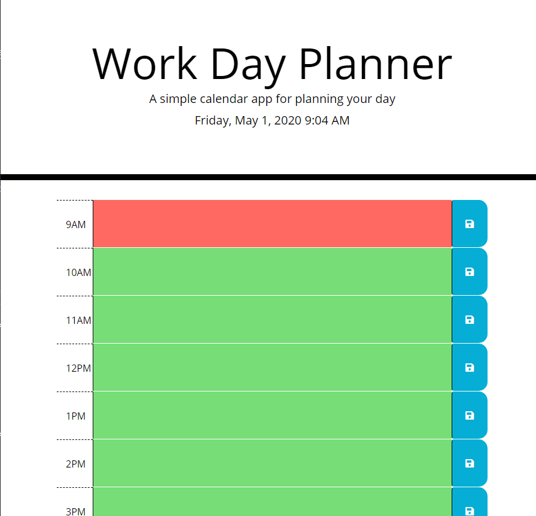

# Daily-Planner

Daily planner allows for scheduling of any events or to do's in a given day. Based on the hour of the day a user can save an event or a task on the page. The info is then stored in the local storage of the computer to keep a record of it. If it is removed and saved it will be removed off the calendar. 

It will also display the current day and time. It will gray out any past tasks not completed and highlight current and future tasks due. 

url: vinnielogithub.io/Daily-Planner

images:
 ;
 ;
 ;
 
